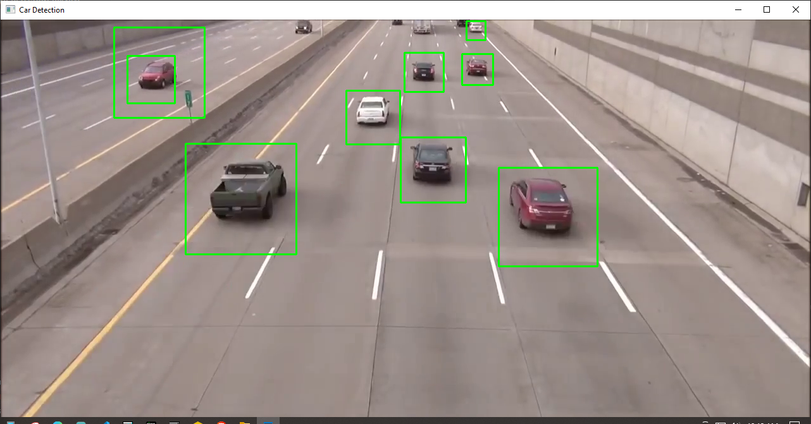

# Car Detection in Video using OpenCV

This project demonstrates real-time car detection in a video using OpenCV and a pre-trained Haar Cascade classifier.

## Overview

The script `car_detection.py` reads a video file (`cars.mp4`) frame-by-frame, detects cars using a Haar Cascade classifier (`cars.xml`), and draws bounding boxes around them. It provides a simple example of object detection using computer vision techniques.

## Features

- Real-time car detection in a video stream.
- Efficient use of OpenCV library for video processing.
- Simple user interface with intuitive exit functionality (`press 'z' to exit`).

## Requirements

- Python 3.x
- OpenCV (`opencv-python` package)
- `cars.mp4` (or replace with your own video file)
- `cars.xml` (Haar Cascade classifier for car detection)

## Installation

1. Clone the repository:

```bash
git clone https://github.com/flameAutomation/Car-Detection-OpenCV.git
cd Car-Detection-OpenCV
```

2. Install dependencies:

```bash
pip install opencv-python
```

3. Run the Script:

```bash
python car_detection.py
```

## Usage

* Ensure `cars.mp4` and `cars.xml` are in the same directory as `car_detection.py`.
* The video will open in a new window showing detected cars with bounding boxes.
* Press `z` on your keyboard to exit the video display.

## Notes:

* `cars.mp4` - Example video used for car detection.
* `cars.xml` - Pre-trained Haar Cascade classifier for car detection.


